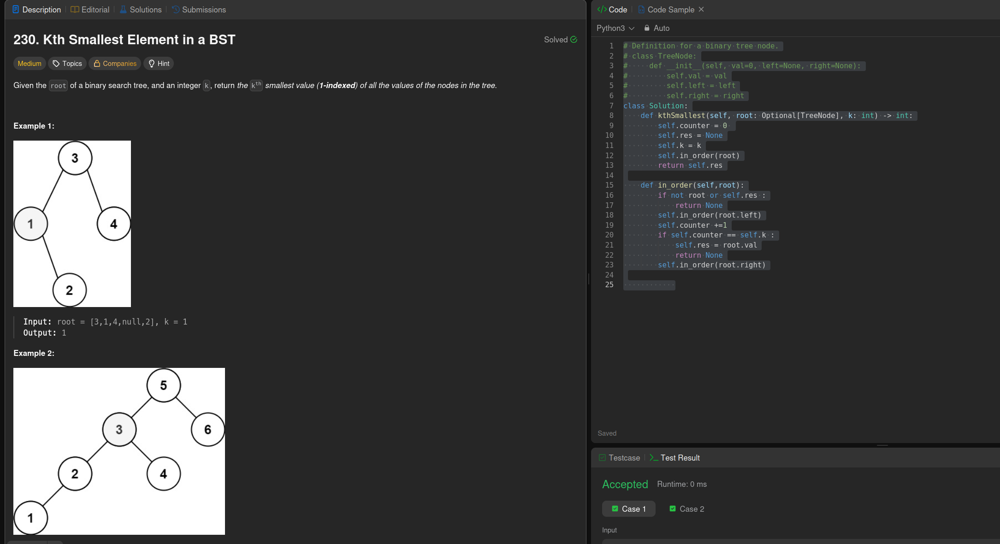

Perform an inorder traversal of the BST to find the kth smallest element. Inorder traversal visits nodes in ascending order for a BST, allowing you to collect values sequentially until you reach the kth one.