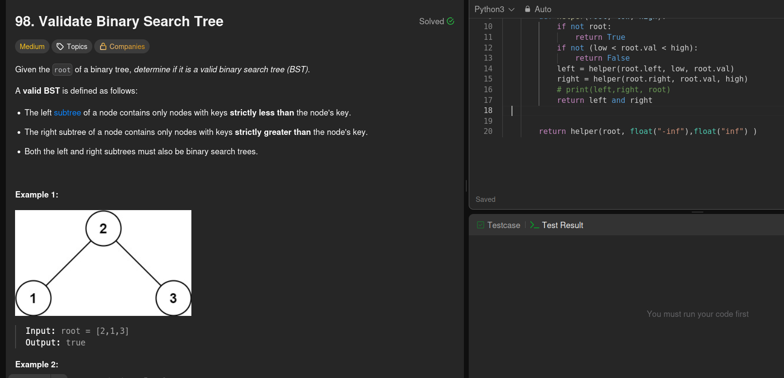

The tips is to validate the binary tree if it is in center lower < root.val < high

You need to travel through each node and range will change with respect to the postion 

if you are on the left side then low = float(-inf) and the max value will be root.val 
and when on right side low value = root.val and the right value is float(inf)