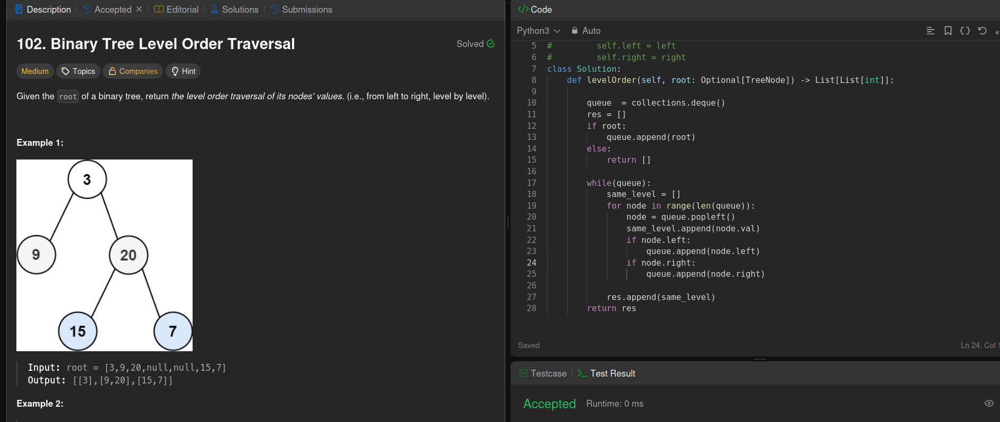

---
BFS question
Have one queue and one list which; list is for the res and queue will keep on storing the level order; while deque the queue you need to have a list which will keep on pushing the elements from the dequeue into it;

As we popleft from queue you need to put the left child and right child into the queue using append, so that the order can be maintained. Put the value of the popleft into a variable which is being pushed into tht samelevel

